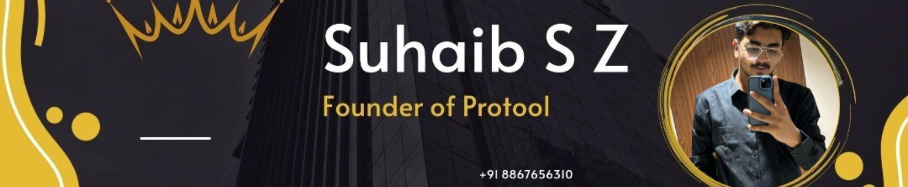

<h2 align="left">Hi 👋! My name is Suhaib and I'm a Web Developer, Entrepreneur, and AI Enthusiast, from India</h2>

###

I’m currently working on building advanced web and app solutions at Protool, focusing on AI, Next.js, React, and 3D GSAP for dynamic user experiences. 🔭 I’m looking to collaborate on open-source AI projects, Next.js innovations, and React-based applications that push the boundaries of interactivity. 👯 I’m looking for help with AI package development, creating immersive 3D animations, and contributions to open-source communities. 🤝 I’m currently learning more about AI frameworks, exploring WebGL, and improving my knowledge of machine learning models. 🌱 Ask me about Protool, Next.js, React, AI package development, and open-source contributions. 💬 Fun fact: I’m passionate about building interactive, 3D web experiences and love experimenting with GSAP for animations. !

###

  
  

###

  
  
  
  
  
  
  
  
  
  
  
  
  
  
  
  
  
  
  
  
  
  
  
  
  
  
  

###
###

  
  
  
  
  

###

 

###
